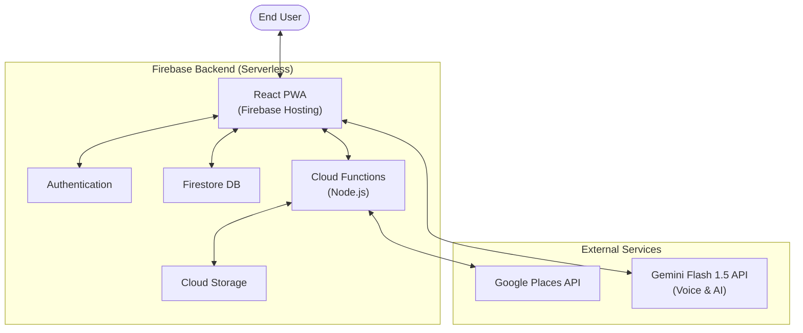
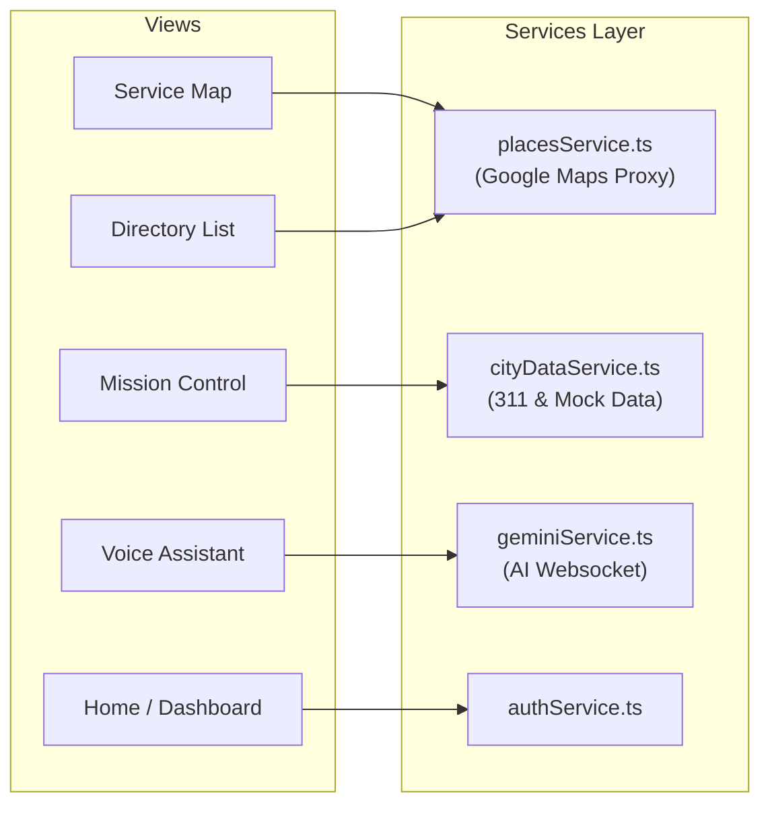
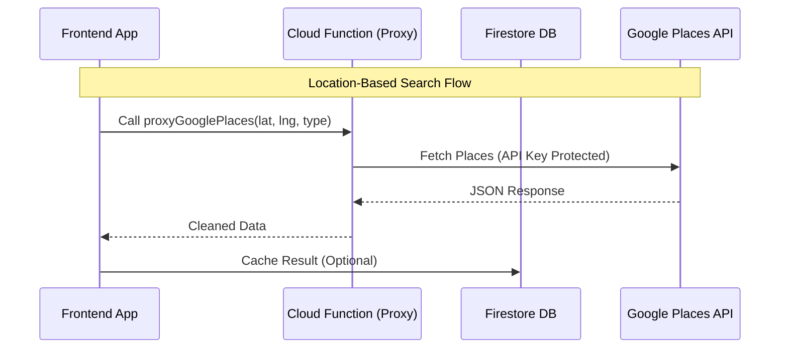

# Community Hero - The Community Operating System

**A unified platform to find support, give help, and build resilient communities.**

## 🚀 Live Demo: [https://community-hero-prod.web.app](https://community-hero-prod.web.app)

---

## 📖 About

**Community Hero** is a "Community Operating System" designed to bridge the gap between those in need and those who can help. It combines a real-time directory of essential services with gamified civic engagement ("Missions") and accessibility-first tools like Voice Mode.

**Core Philosophy:** Mission + Trust + Proof.

---

## 🏗 System Architecture

### 1. High-Level Overview

The system follows a serverless architecture leveraging **Firebase** for backend services and **React** for a responsive frontend.



### 2. Frontend Architecture

Built with **Vite + React + TypeScript**. Logic is separated into reusable Services and UI Components.



### 3. Backend & Data Flow

**Cloud Functions** act as a secure proxy for third-party APIs and handle background synchronization.



---

## ✨ Key Features

### 🔍 Find Help (Directory Lane)

- **Real-time Map:** Locate Verified Food Banks, Shelters, and Hospitals.
- **Smart Filters:** "Open Now", "Wheelchair Accessible".
- **Mesh Mode:** Offline-ready data indicators for low-connectivity areas.

### 🛡️ Give Support (Missions Lane)

- **Civic Action:** Gamified missions (e.g., "Report Hazard", "Donate Food").
- **Verification:** "Before & After" photo proof for trust.
- **Impact Tracking:** Earn "Impact Credits" and badges.

### 🎙️ Accessibility (Voice Lane)

- **Hands-Free Mode:** powered by **Gemini Multimodal Live API**.
- **Natural Conversation:** Ask "Where is the nearest food bank?" and get spoken directions.
- **Visual Context:** The AI can "see" your screen to help explain complex forms.

---

## 🛠 Tech Stack

- **Frontend:** React, TypeScript, Vite, TailwindCSS (via custom CSS)
- **Backend:** Firebase (Auth, Firestore, Cloud Functions).
- **AI:** Google Gemini Flash 1.5 (Multimodal Live API).
- **Maps:** Google Maps Platform (Places API, Geocoding).
- **Build/Deploy:** GitHub Actions, Firebase Hosting.

---

## 🚀 Getting Started

### Prerequisites

- Node.js 18+
- Firebase CLI (`npm install -g firebase-tools`)

### Installation

1. **Clone the repo**

   ```bash
   git clone https://github.com/samalpartha/CommunityOS.git
   cd CommunityOS
   ```

2. **Install dependencies**

   ```bash
   npm install
   ```

3. **Set up Environment Variables**
   Create a `.env` file with your Firebase and Google API keys:

   ```env
   VITE_FIREBASE_API_KEY=...
   VITE_GOOGLE_PLACES_API_KEY=...
   VITE_GEMINI_API_KEY=...
   ```

4. **Run Locally**

   ```bash
   npm run dev
   ```

### Deployment

**Deploy to Production:**

```bash
npm run build
firebase deploy
```
